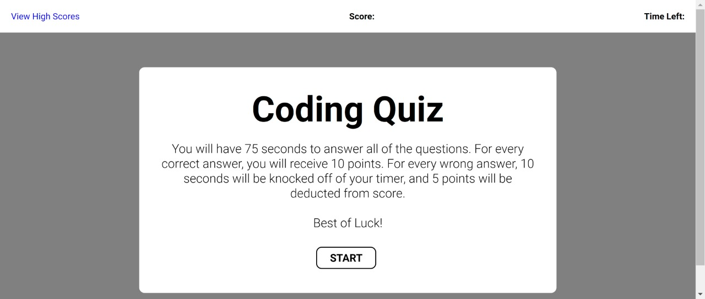

# Coding-Quiz
## General Info

*   Created a timed Coding Quiz using HTML, CSS, and JS

*  User gets 10 points for each correct answer, -5 point and -10 seconds for each incorrect answer.

*   User can save score and initials. highest five scores are saved on leadership board

*   Link to Deployed Site: (https://jnunez1229.github.io/password-generator/)
 
### Screenshot

---